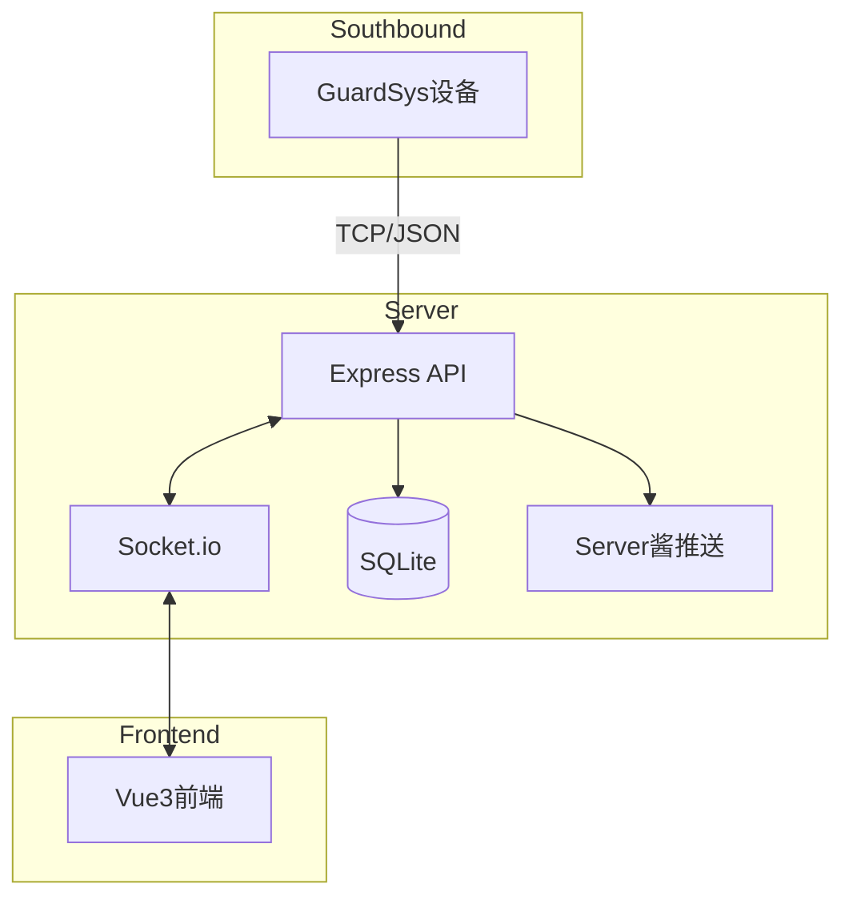

# GuardSys Web Monitor System

Feature Name: guardsys-web-monitor
Updated: 2026-06-12

## Description

南向设备Web监控系统，提供设备连接、数据接收、Web实时展示、设备控制、报警推送功能。

## Architecture



## Components and Interfaces

### 1. TCP Server (Express + Socket.io)

- **端口**: 3000
- **协议**: HTTP + WebSocket
- **功能**:
  - 接收南向设备TCP连接
  - 解析JSON数据
  - 通过Socket.io广播给前端
  - 转发控制指令给设备

### 2. Data Model

```typescript
interface SensorData {
  type: 'report' | 'cmd';
  temp?: string;
  humi?: string;
  smoke?: number;
  ir?: boolean;
  alarm?: number;
  action?: string;
  value?: number;
}

interface Device {
  id: string;
  name: string;
  connectedAt: Date;
  lastData: SensorData | null;
  online: boolean;
}
```

### 3. Server酱推送

- **触发条件**: 烟雾>=200 或 温度>=40
- **API**: https://sctapi.ftqq.com/{sckey}.send
- **内容**: 包含温度、湿度、烟雾浓度、报警状态

### 4. Web前端 (Vue3)

- **技术栈**: Vue3 + Vite + Socket.io-client
- **页面**:
  - 设备列表/状态
  - 实时数据仪表盘
  - 控制面板
  - 历史记录

## Data Models

### SQLite Tables

```sql
CREATE TABLE devices (
  id TEXT PRIMARY KEY,
  name TEXT,
  connected_at DATETIME,
  last_seen DATETIME,
  online INTEGER DEFAULT 0
);

CREATE TABLE sensor_logs (
  id INTEGER PRIMARY KEY AUTOINCREMENT,
  device_id TEXT,
  temp REAL,
  humi REAL,
  smoke REAL,
  ir INTEGER,
  alarm INTEGER,
  created_at DATETIME DEFAULT CURRENT_TIMESTAMP,
  FOREIGN KEY (device_id) REFERENCES devices(id)
);
```

## Correctness Properties

1. 设备断开后online字段为0
2. 每次传感器数据都记录到sensor_logs
3. Server酱推送后记录推送状态，避免重复推送
4. 历史数据保留7天

## Error Handling

- 设备连接失败: 重试机制
- 数据解析错误: 记录错误日志，返回错误消息
- Server酱推送失败: 记录重试次数，最大3次
- WebSocket断开: 自动重连

## Test Strategy

- 单元测试: 数据解析、报警逻辑
- 集成测试: TCP连接、Socket.io通信
- 手动测试: 设备连接、前端交互、推送测试

## References

[^1]: GuardSysAPP - OpenHarmony北向监控系统
[^2]: Server酱 - 微信推送服务 https://sct.ftqq.com/
